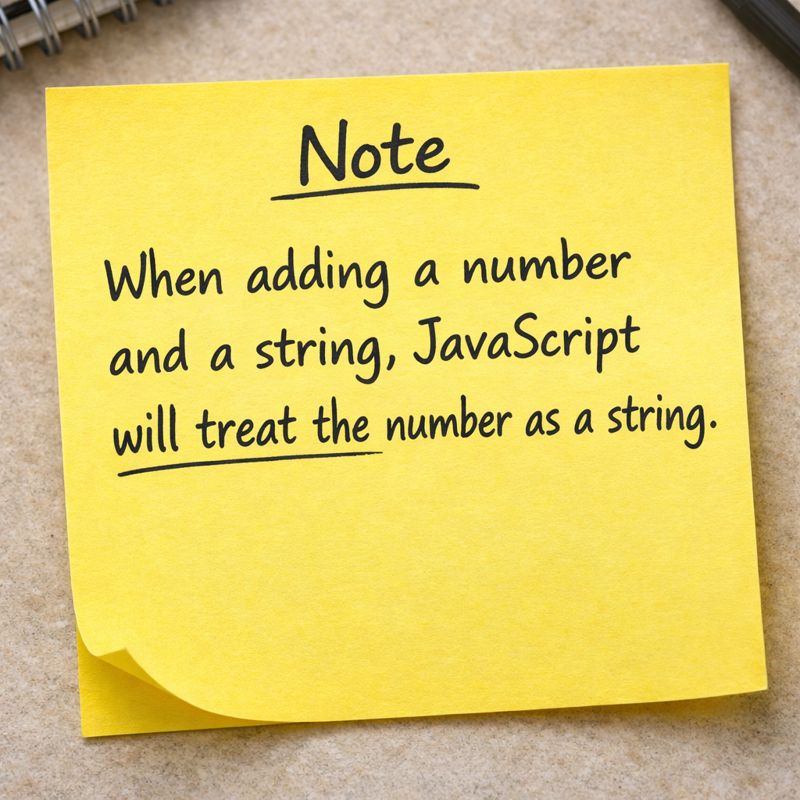

# Datatypes in JS 
A JavaScript variable can hold 8 types of data:-

- 7 Primitive Data Types and 1 Object Data Type

The Object data type can hold many different object types


| Type      | Description                                      |
|-----------|--------------------------------------------------|
| Number    | A number representing a mathematical value       |
| Bigint    | A number representing a large integer            |
| String    | A text of characters enclosed in quotes          |
| Boolean   | A data type representing true or false           |
| Undefined | A primitive variable with no assigned value      |
| Null      | A primitive value representing object absence    |
| Symbol    | A unique and primitive identifier                |
| Object    | A collection of key-value pairs of data          |

## Examples for each datatype 

``` js 
// Number
let length = 16;
let weight = 7.5;

// BigInt
let x = 1234567890123456789012345n;
let y = BigInt(1234567890123456789012345)
// Strings
let color = "Yellow";
let lastName = "Johnson";


// Boolean
let x = true;
let y = false;

// Undefined
let x;
let y;

// Null
let x = null;
let y = null;

// Symbol
const x = Symbol();
const y = Symbol();

// Object
const person = {firstName:"John", lastName:"Doe"};

// Array Object
const cars = ["Saab", "Volvo", "BMW"];

// Date Object
const date = new Date("2022-03-25");
```

## Some important things to notice 



``` js 
// To be able to operate on variables, it is important to know something about the type. Without data types, a computer cannot safely solve this 

let x = 16 + "Volvo";
console,log(x);

// Does it make any sense to add 16 to Volvo basically a number and a string ? but JS will treat the number 16 as string of 16 i.e. "16" and concatinate both of them"

// JS's assumption

let x = "16" + Volvo;
console.log(x); // Output -> 16Volvo

let y = 16 + 4 + Naman;
console.log(y); // Output -> 20Naman
```


